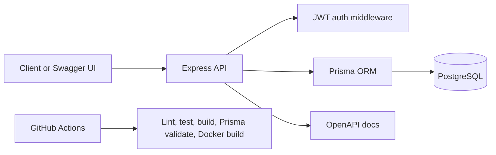

# Cloud Issue Tracker API Architecture

## Overview

Cloud Issue Tracker API is a TypeScript backend for managing projects, tickets, assignments, statuses, priorities, and ticket comments.

## Core Modules

- `auth`: registration, login, password hashing, JWT issuance.
- `projects`: project CRUD guarded by role-based access control.
- `tickets`: ticket creation, assignment, status updates, and filtering.
- `comments`: ticket discussion history.
- `health`: database-backed readiness check.

## Security Choices

- Passwords are hashed with bcrypt.
- Auth uses signed JWT bearer tokens.
- Admin-only actions are protected with role middleware.
- Helmet, CORS, rate limiting, and request validation are enabled globally.

## CI/CD

The GitHub Actions workflow starts PostgreSQL, installs dependencies, generates the Prisma client, validates the schema, applies the test database schema, runs lint/tests/build, and verifies the Docker image builds.
